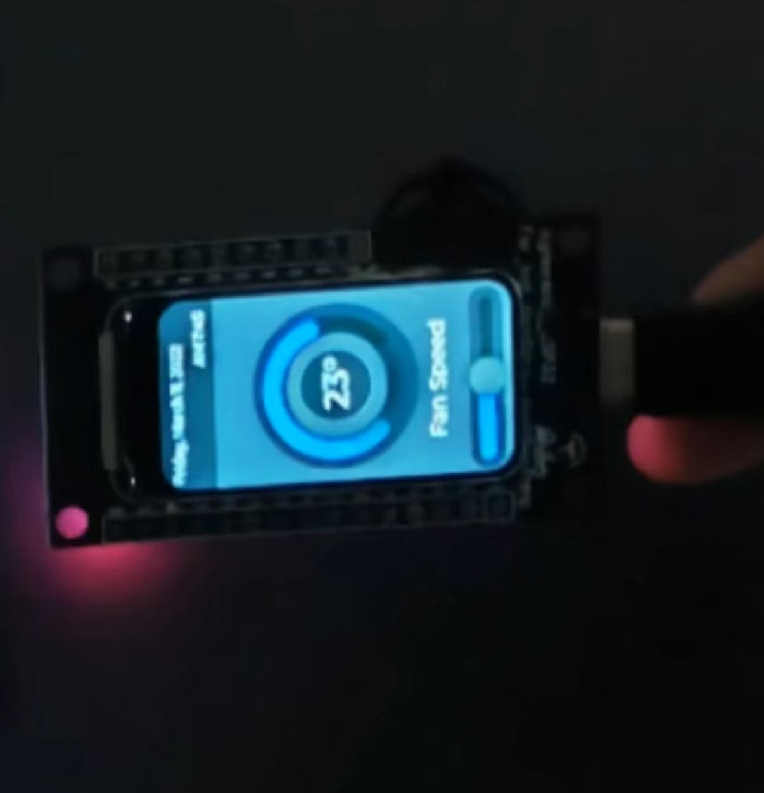
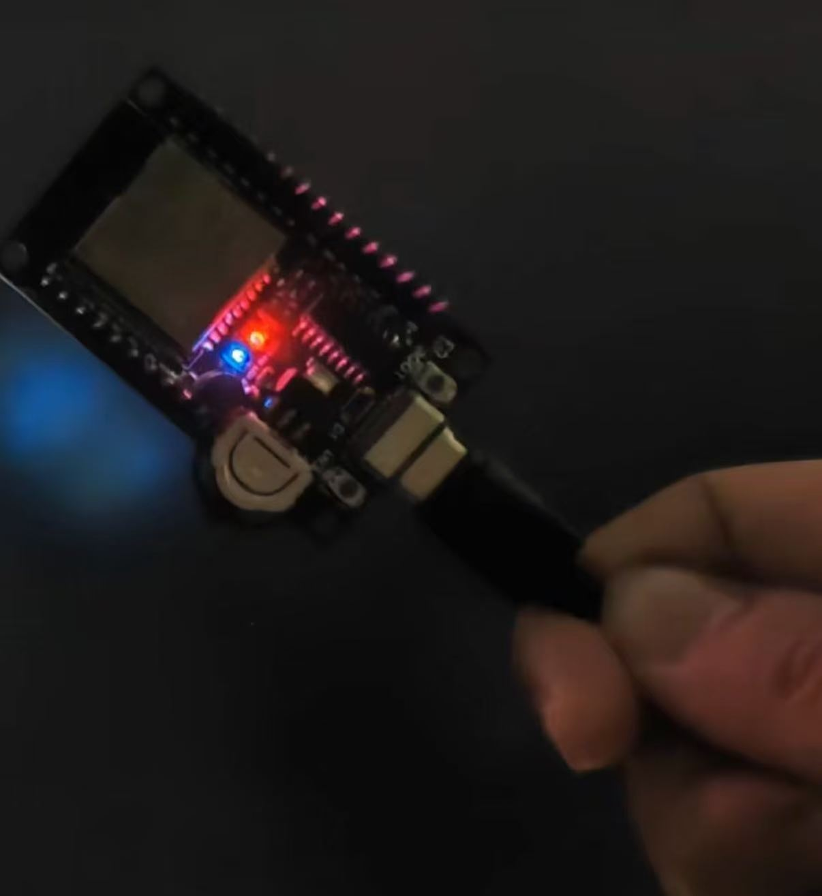
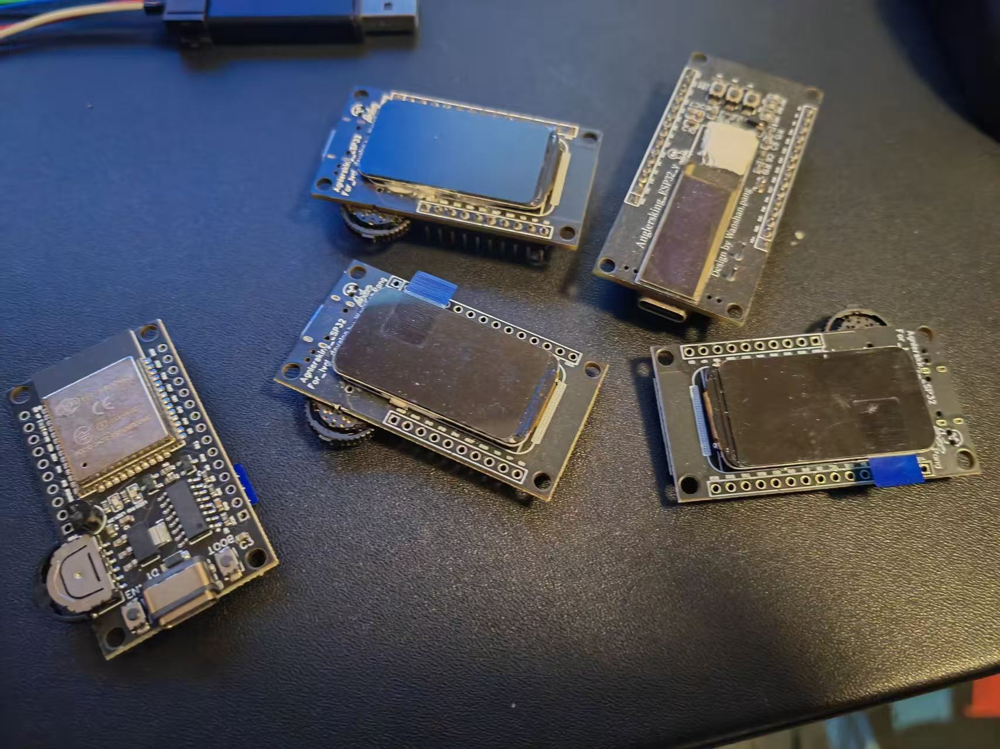
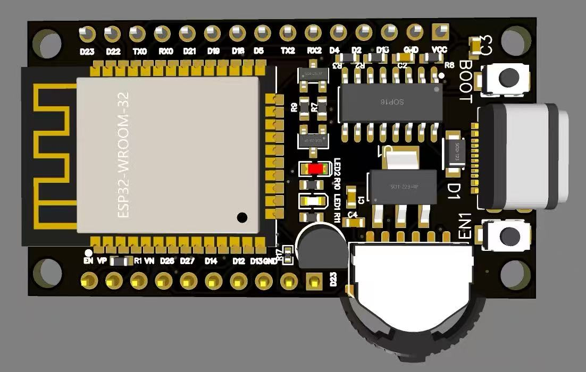
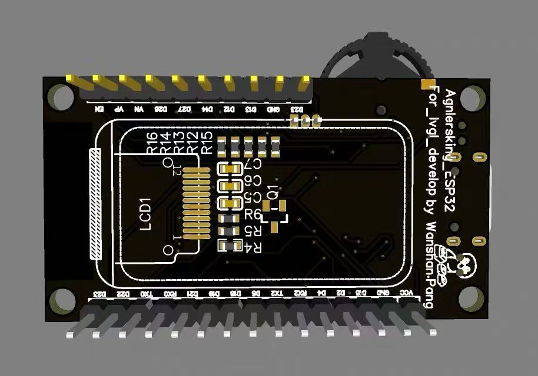
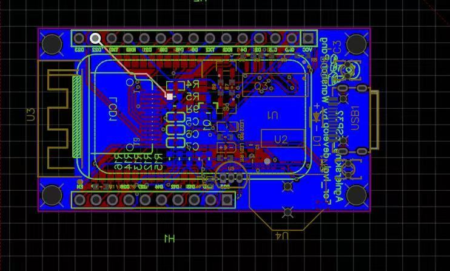

# One ESP32 Core Display

**ESP32 最小系统 + 显示屏** —— 集成 1.47 寸 IPS LCD、波轮按键/旋钮、DS18B20 温度传感器，专为 LVGL 智能家居面板、桌面信息屏等场景设计。

---

## 概览

一块以 ESP32-WROOM-32 为核心的最小系统板，板载 1.47 寸 172×320 IPS 彩屏，搭配波轮按键、多路 GPIO 检测和 DS18B20 温度传感器接口。USB Type-C 供电，CH340C 串口，自动下载电路，即插即用。

| 特性 | 描述 |
|------|------|
| **主控** | ESP32-WROOM-32，双核 Xtensa LX6 @ 240MHz |
| **屏幕** | 1.47 寸 IPS LCD，172×320，SPI 接口 |
| **存储** | 板载 Flash + PSRAM（取决于模组型号） |
| **温度** | DS18B20 数字温度传感器接口 |
| **输入** | 波轮按键/旋钮检测（多路 GPIO） |
| **调试** | CH340C USB 转串口，自动下载电路 |
| **供电** | USB Type-C，AMS1117-3.3 稳压 |
| **扩展** | 双排扩展接口 H1 / H2 引出丰富 GPIO |
| **兼容** | LVGL 图形框架、Arduino、ESP-IDF |

---

## 图片

| 实物（正面） | 实物（背面） |
|:---:|:---:|
|  |  |

| 多板俯拍 | PCB 正面渲染 |
|:---:|:---:|
|  |  |

| PCB 背面渲染 | PCB 布线图 |
|:---:|:---:|
|  |  |

---

## 板载资源

### 引脚定义

#### 显示屏 SPI

| 信号 | GPIO |
|------|------|
| SCLK | GPIO15 |
| MOSI | GPIO2 |
| CS | GPIO5 |
| DC | GPIO4 |
| RST | GPIO18 |
| BL（背光） | GPIO22 |

#### 按键 / 旋钮检测

| 信号 | GPIO |
|------|------|
| 按键/旋钮 1 | GPIO25 |
| 按键/旋钮 2 | GPIO33 |
| 按键/旋钮 3 | GPIO32 |
| 按键/旋钮 4 | GPIO35 |
| 按键/旋钮 5 | GPIO34 |

> 以上引脚均带 10kΩ 上拉电阻，适用于波轮编码器或独立按键检测。

#### 温度传感器

| 信号 | GPIO |
|------|------|
| DS18B20 数据 | GPIO14 |

#### 控制与状态

| 功能 | 引脚 |
|------|------|
| EN 复位 | EN |
| BOOT 下载 | GPIO0 |
| USB 串口 RX | RX0 |
| USB 串口 TX | TX0 |
| 自动下载 | DTR → EN，RTS → GPIO0 |

#### 扩展接口 H1

| 引脚 | 信号 |
|:---:|------|
| 1 | +5V |
| 2 | GND |
| 3 | GPIO13 |
| 4 | GPIO12 |
| 5 | GPIO14 |
| 6 | GPIO27 |
| 7 | GPIO26 |
| 8 | VN (ADC) |
| 9 | VP (ADC) |
| 10 | EN |

#### 扩展接口 H2

| 引脚 | 信号 |
|:---:|------|
| 1 | VCC |
| 2 | GND |
| 3 | GPIO15 |
| 4 | GPIO2 |
| 5 | GPIO4 |
| 6 | RX2 |
| 7 | TX2 |
| 8 | GPIO5 |
| 9 | GPIO18 |
| 10 | GPIO19 |
| 11 | GPIO21 |
| 12 | RX0 |
| 13 | TX0 |
| 14 | GPIO22 |
| 15 | GPIO23 |

---

## 软件 / 固件

### LVGL

本开发板专为 LVGL 图形框架设计，1.47 寸 IPS 屏（172×320）适合竖屏信息显示：
- 智能家居控制面板
- 温湿度/环境监测
- 桌面信息屏 / 倒计时器
- 音乐播放器控制

### 通用 Arduino / ESP-IDF

完全兼容 Arduino 框架和 ESP-IDF，可作为通用 ESP32 最小系统板使用。

---

## 参考

- [ESP32 数据手册](https://www.espressif.com/sites/default/files/documentation/esp32_datasheet_en.pdf)
- [LVGL 图形库](https://lvgl.io/)
- [DS18B20 数据手册](https://www.analog.com/media/en/technical-documentation/data-sheets/DS18B20.pdf)

---

## 许可

本项目基于 [MIT License](LICENSE) 开源。

Copyright (c) 2026 Wanshan Pang
